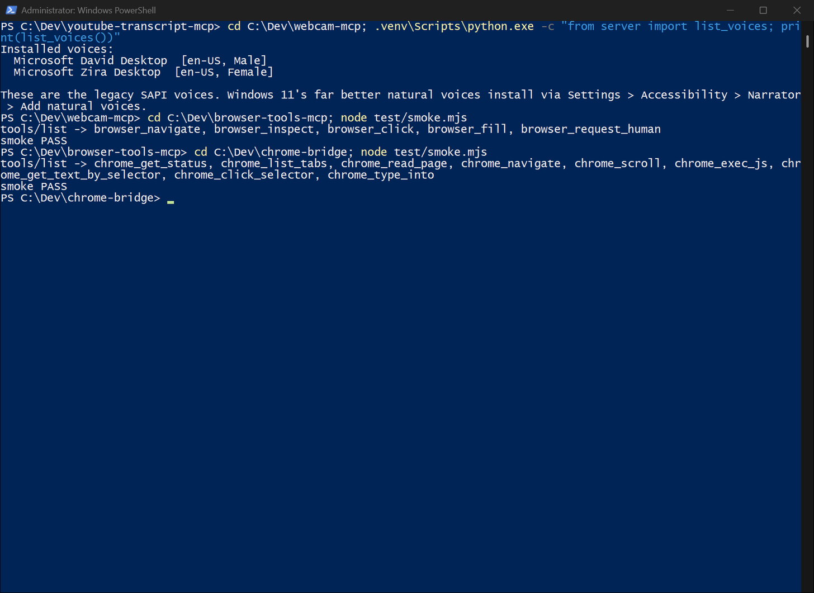

# Chrome Bridge — browser control for OpenCode & Claude Code

MCP server plus extension letting agents drive your logged-in Chrome, including login-walled sites.

[](LICENSE)
[](https://github.com/luigimasango-dev/chrome-bridge/actions/workflows/ci.yml)
[](https://nodejs.org/)



## Quick start

Requires Node 24+. Tested 2026-09-11 from a fresh clone on Windows 11:

```powershell
git clone https://github.com/luigimasango-dev/chrome-bridge.git
cd chrome-bridge
npm ci
node test/smoke.mjs
```

That launches the real server over stdio and asserts all nine tools —
no Chrome needed. The live loop (extension driving real tabs) needs the
one-time install below.

## Install (one-time, human hands)

1. **Chrome:** open `chrome://extensions`
2. Turn on **Developer mode** (top-right)
3. **Load unpacked** → select `C:\Dev\chrome-bridge\extension`
4. Pin the extension if you like; the badge shows `ON` when the bridge is up.
5. Keep at least one normal Chrome window open while agents need the browser.

Lets agents drive your **live, logged-in Chrome** — which is what makes
blocked sites readable: X/Twitter, LinkedIn, Reddit, and anything else that
refuses plain HTTP scraping works because it runs in a real logged-in
browser.

The MCP server is registered in the OpenCode config as `chrome-bridge`.
Restart OpenCode to load it.

## How it works

```
OpenCode / Claude Code
        │  (MCP stdio)
        ▼
server/server.js ── owns a WebSocket on ws://127.0.0.1:8765
        │  (JSON {id, action, params} → {id, ok, result})
        ▼
extension/background.js (service worker) → content.js injected per tab → DOM
```

The extension cannot listen on a port (MV3), so the **MCP server owns the
socket** and the extension dials out to it. Keep one Chrome window open and
the extension loaded, and agents can read/navigate it.

## Security model

- **Read-only by default.** `chrome_list_tabs`, `chrome_read_page`,
  `chrome_navigate`, `chrome_scroll`, `chrome_exec_js`,
  `chrome_get_text_by_selector` all work out of the box.
- **Write actions are gated.** `chrome_click_selector` and `chrome_type_into`
  return `BLOCKED:` unless `CHROME_BRIDGE_ALLOW_WRITE=true`. This matches the
  machine rule: write-capable tools stay out of unattended OpenCode runs.
  Only enable it for an interactive session, deliberately.
- **Loopback only.** Nothing here touches the network except the extension's
  connection to `ws://127.0.0.1:8765`.

## Tools

| Tool | What it does | Write? |
|---|---|---|
| `chrome_get_status` | connected? write enabled? | — |
| `chrome_list_tabs` | all open tabs (id, title, url) | — |
| `chrome_read_page` | visible text of active tab (≤200KB) | — |
| `chrome_navigate` | open a URL in active tab | read |
| `chrome_scroll` | up/down/top/bottom | read |
| `chrome_get_text_by_selector` | text of all nodes matching a CSS selector | read |
| `chrome_exec_js` | run JS in active tab | read |
| `chrome_click_selector` | click first match | **gated** |
| `chrome_type_into` | type into input (input+change events) | **gated** |

## Manual smoke test (without OpenCode)

```powershell
# Terminal 1 — start the server
cd C:\Dev\chrome-bridge; node server/server.js

# Terminal 2 — check the loopback endpoint
Invoke-RestMethod http://127.0.0.1:8765/
# → {"ok":true,"name":"chrome-bridge","connected":false,"allowWrite":false}
```

`connected: true` appears once the extension is loaded in a Chrome window.

## Limitations

- CI runs only the stdio smoke test. The live bridge check
  (`test_ws_bridge.mjs`) needs the extension loaded in a real Chrome, so it
  stays a local command. Known 2026-09-11 finding: with the extension
  connected (`connected:true`), `list_tabs` over the WS bridge timed out
  twice — tracked as an issue, cause still open.
- Content scripts cannot run on `chrome://` pages; if the active tab is one
  of those, tab actions may fail while `list_tabs` still works.

## Development

```powershell
npm ci
node test/smoke.mjs   # fast: tools/list over stdio, no Chrome needed
node test_ws_bridge.mjs  # live: needs server running + extension in Chrome
```

## Files

- `extension/` — MV3 extension (manifest, background SW, content script, popup)
- `server/bridge.js` — WS host + request routing + write gate
- `server/server.js` — MCP stdio entrypoint
- `test/smoke.mjs` — CI smoke test: `tools/list` over stdio
- `test_ws_bridge.mjs` — live bridge check (local only)

## License

MIT. See [LICENSE](LICENSE).
